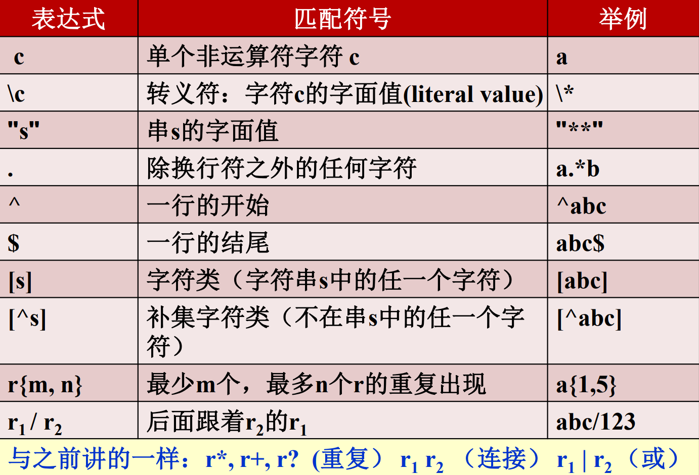

# Compiler

## Intro
编译器的前端和后端：

- 前端：从源代码到中间代码的翻译，与具体的机器无关
- 后端：从中间代码翻译成具体的机器指令（目标代码）

编译器的流程：词法分析->语法分析->语义分析->中间代码生成->代码优化->目标代码生成。

Pass（一遍）：对源程序或其等价的中间形式（通常以文件形式存在）从头到尾扫视一次，完成预定的处理任务。

## 词法分析
作用：读入源程序字符流、输出token序列，可以过滤空格换行注释等，将token信息添加到符号表

- 词法单元（token）：<词法单元名、属性值>
- 模式（pattern）：描述一类词法单元词素可能具有的形式
- 词素（lexeme）：源程序中的字符序列

Token的类别：

- 关键字（保留字）：int, if, then。
- 标识符
- 字面常数：3.14，true，"abc"
- 运算符：+、-、*、/
- 分界符：','、';'、':'

### 正则表达式
$r$是一个正则表达式,表示的语言是$L(r)$

- $\epsilon$是正则表达式
- $a \in \Sigma$,$a$是一个正则表达式
- $r,s$都是正则表达式：
    - $(r)|(s)$是，表示$L(r)\cup L(s)$
    - $(r)(s)$是，表示$L(r)L(s)$
    - $(r)^*$是，表示$(L(r))^*$
- $(r)^+$表示$(L(r))^+$
- $r?$表示$r|\epsilon$
- $[abc]$表示$(a|b|c)$,$[a-z]$表示$(a|b|c|...|z)$

### 输入缓冲
采用双缓冲区+哨兵标记，保证读取到eof的安全性。