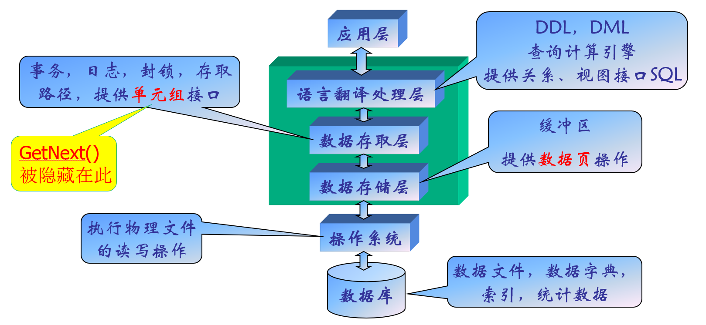

# Database

## Intro

- 概念数据模型：实体和实体之间具有的联系，构成概念数据模型。E/R（实体-联系模型）、ODL（对象描述语言）
- 结构数据模型：图、关系等，从计算机的实现出发。

> 三要素：数据结构(描述系统的静态特性)，数据操作（描述系统的动态特性）和数据约束条件（完整性规则的集合）
    
### 层次模型
用树来表示，结构简单但是支持的联系种类太少，数据操作不方便。

### 网状模型
有向图，通过指针表达联系。

### 关系模型
用二维表来表示实体及其相互联系。

### 模式
数据库模式：表示相对固定的类型，实例则代表数据库的值。类型是稳定的，值是变化的。

数据库系统具有三级模式结构：模式、外模式、存储模式，外模式是模式的子集，表示用户的数据视图；内模式则是表示数据的存储模式、物理结构。

### 层次结构

- 数据库：数据的集合。
- 数据库管理系统（DBMS）：系统软件，对数据库进行管理。
- 数据库系统：带数据库的整个计算机系统。

对于DBMS而言，也分成了很多层：
  

> DDL语言：用来描述模式

> DML语言：对数据库进行操作的语言，分为宿主类和自含类。

DBA：负责数据库的全面管理和控制，慢慢走向Autoadmin。

## E-R（实体-联系）模型

### 基本概念
实体：客观存在并可相互区分的事物叫实体

属性：实体所具有的某一特性；域：属性的取值范围

实体型：实体名+属性名集合；实体集是同型实体的集合。

联系(Relations  hip)：实体之间的相互关联，联系也可以有属性

联系的元：参与联系的**实体集**的个数

> OLTP：事务处理型软件技术，比较链状的ER图适合做这个事情。
> OLAP：分析型软件技术

超码（superkey）：能唯一标识实体的属性或属性组

候选码(candidate key)：其任意真子集都不能成为超码的最小超码

主码(primary key)：从所有候选码中选定一个用来区别同一实体集中的不同实体

### 属性
- 简单属性：不可再分的属性
- 复合属性：可以划分为更小的属性

-------

- 单值属性：每一个特定的实体在该属性上的取值唯一
- 多值属性：某个特定实体在该属性上有多于一个的取值

--------

派生属性：可以从其他相关的属性或实体派生出来的属性值，而那些参与计算的属性被称为基属性（存储属性）

NULL属性：表示未知值（无意义）。

### 联系基数
实体之间的联系的数量，即一个实体通过一个联系集能与另一实体集相关联的实体的数目。

分为1对1，1对多（1:m），多对多（n:m）。

E-R图中的箭头：多方实体集指向联系，联系指向单方实体集。多元联系中最多只有一个箭头。

**势：一个实体出现在联系中的次数。**区分强制性和可选性联系